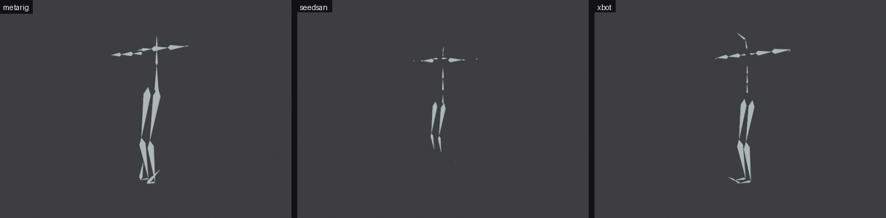
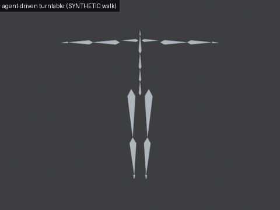
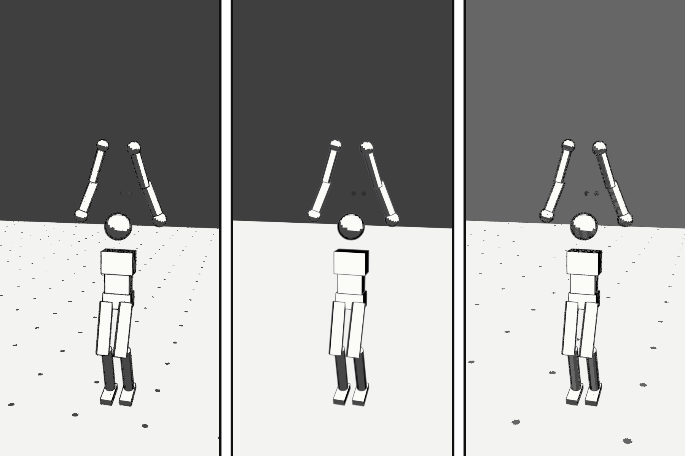

# riggermortis

**Any rig. Any image. One click — or one agent tool call. Your GPU, your characters, zero uploads.**

A local, free, rig-agnostic posing & animation engine with two frontends: a
**Blender add-on** for artists and an **MCP server** so coding agents can drive
Blender directly. Drop in an already-rigged model and a reference image — the
pose is applied. Drop in a video — the character is animated, retargeted,
foot-slide-cleaned. Point it at a live pose stream and the rig puppeteers in
real time, with smoothing, a latency readout, and a failsafe. Photos and
anime/manga art both work. Render as anime, manga, or cartoon; lay scenes out
into manga pages and comic PDFs.

Everything runs on the user's machine: no cloud, no accounts, no uploads, no
telemetry — and a CI test keeps that verifiably true.

## Status: Phases 0–4 closed (mapping, posing, video, MCP, style/manga) · Phase 5 live mode: P5-1 + P5-2 + P5-3 shipped, gate-verified on replayed streams — the recorded live demo (P5-4) waits on a real camera · Phase 6 opened: the 18+ enforcement pair (P6-4 + P6-5) shipped — module default-OFF, two-toggle enable, test-pinned in both frontends · secondary motion (P6-1) shipped — spring-chain follow-through on appendage bones, riding after the certified composition (docs/SECONDARY_MOTION.md) · chain-binding presets (P6-1a) shipped — a per-rig preset (format 2, back-compat read of 1) carries the chain bindings fingerprint-gated from author to bake: `rigpose preset save --secondary` writes them, the session-bridge bake loads them and feeds `bake_action(secondary=…)` (gate `make pose-verify` RM_SECONDARY PRESET: preset keys = direct keys) · motion-library retarget (P6-2) DONE — imported Mixamo/BVH/FBX clips become the same canonical actions the video pipeline produces (bridge sampler `xtask/sample_clip.py`, gate `make pose-verify` RM_MOTION, docs/MOTION_LIBRARY.md): the certified foot-slide cleanup runs unchanged — the synthetic sliding-walk fixture locks 0.614 u → 0.0000 u, and the real Xbot.glb `walk` retarget re-evaluates at 0.0000° (docs/BENCHMARKS.md MOTION) · Phase 8 opened ("the Producer"): multi-figure scenes (P8-1) shipped — one payload poses N paired rigs in one action (`apply_scene` session action + the Casting Desk panel; gate `make pose-verify` RM_SCENE APPLY2: 0.0198°/0.0063° worst on real detector figures, bar 0.5°), contact pins ride payload v3 as data and AUTHORED pins now ENFORCE through the deterministic coupling pass (P8-2): the coupled solve closes the gate fixture's authored pins at 0.00016/0.00035 torso-span fracs (bar 0.02) while suggested and below-floor pins stay loud, untouched data (gate `make pose-verify` RM_COUPLE; docs/BENCHMARKS.md COUPLING), and the APPROXIMATE scene camera stages from the reference framing only above the measured IoU 0.75 floor — it refuses loudly below it (gate RM_SCENE CAMERA-STAGE 0.8279 / CAMERA-REFUSE 0.3388; floor derivation in docs/BENCHMARKS.md SCENE) · finger chains (P8-3) shipped — the additive D-021 namespace solves per-finger 3-joint chains ONLY from observed hand keypoints: below the 0.55 confidence floor a finger is skipped and LEDGERED, never guessed (occlusion fixtures gate-skip 100%; real photos: 25 fingers solved / 30 loudly skipped), the 20-pose hand benchmark measures per-segment direction at median 0.00° / p90 10.30° (bars 20°/35°), and preset-mapped apply lands finger bones at 0.0070° worst on metarig- and Mixamo-class rigs (gate `make pose-verify` RM_FINGER; docs/BENCHMARKS.md FINGERS)

| | |
|---|---|
|  |  |

Left: the pipeline's own BOOM render — rest rig → solved pose applied through
the add-on's apply path, regenerated headlessly by
`bash xtask/render_boom.sh` (the pipeline refuses to pose anything it can't
verify to ≤0.5° per bone before shooting). Right: the Phase-2 close — one
labeled SYNTHETIC walk retargeted to three real rigs (Rigify | Seed-san VRM |
Mixamo) through the documented cleanup pipeline, feet IK-locked during their
plants (lock ratios 21.7×/12.0×/21.1× per rig); regenerated headlessly by
`make walk-gifs`. Per-rig numbers and the honest synthetic-vs-real-clip
status live in [docs/BENCHMARKS.md](docs/BENCHMARKS.md) — regenerate them
yourself instead of trusting us.

What exists **right now** (every claim cites a test, gate, or number):

- **Rig-agnostic mapping** — Rigify / Mixamo / VRM / opaque custom rigs:
  name heuristics + geometry fallback, per-role confidence, ambiguity flags.
  Real-rig gate: metarig, 706-bone generated Rigify, Seed-san VRM, and a real
  Mixamo export all map with **0 manual corrections**
  ([docs/BENCHMARKS.md](docs/BENCHMARKS.md), Phase-0 real-rig gate;
  `xtask/blender_verify.sh`).
- **One-image posing** — DWPose detection → 2.5D canonical solve → FK apply
  on any mapped rig, applied in-process by the add-on at **≤0.5° per bone**
  (worst measured: 0.026°, `make pose-verify`), with a viewport review
  overlay and one-click flip fixes. Honest number: on a 10-photo benchmark
  **0/10 are usable with zero review** under strict criteria (median
  confidence 0.66; legs verify, arms often need a one-click flip) — the
  review UI is the designed remedy, and the gap is decomposed in
  [docs/BENCHMARKS.md](docs/BENCHMARKS.md).
- **Video pipeline (Phase 2, closed on honest numbers)** — frame extraction
  (ffmpeg shell glue) → per-frame detection/solve with crash-safe resume and
  an honest failure ledger → **canonical actions** → keyframed retarget baked
  onto any mapped rig (2-frame bake verified on a real rig at 0.024°/frame)
  → foot contact detection with hysteresis → IK foot lock (the labeled
  synthetic walk, retargeted to **three real rigs** through the add-on's real
  bake: ankle drift within a plant drops **21.7×/12.0×/21.1×** on Rigify /
  VRM / Mixamo rigs; walk-in-place by design — no fabricated root motion) →
  motion denoise: hip stabilization + 1€ jitter pass (stabilization alone
  halves the breathing-induced stance slide on the synthetic gate) →
  **FBX/glTF export with a verified round-trip** (skeleton, animation, and
  pose fidelity re-measured after re-import at ≤2° — measured worst 0.0164°
  glTF / 0.0140° FBX, `make export-verify`; VRMA has no builtin exporter and
  is honestly scoped in [docs/EXPORT.md](docs/EXPORT.md)). Honest limits: the
  GIFs above are the LABELED SYNTHETIC walk (generator cited; a
  licensing-clean real clip is still NEEDS-HUMAN), and the "dance + fight
  clips" gate is recorded NOT-met-with-real-clips in
  [docs/BENCHMARKS.md](docs/BENCHMARKS.md).
- **Live mode (Phase 5, P5-1 + P5-2 + P5-3 shipped — replay-verified)** — a
  realtime-class pose **side process** (`rigpose live`) watches a frames
  directory and emits one D-009 payload-v2 JSON line per frame;
  the add-on's own apply path consumes them unchanged
  ([docs/LIVE.md](docs/LIVE.md) is the design of record). Measured side
  process (STATIC REPLAY, i5 CPU, [docs/BENCHMARKS.md](docs/BENCHMARKS.md)
  LIVE block): full detect ≈ 550 ms/frame, tracked (detector every 5th)
  ≈ 88 ms p50, pose-only ≈ 90 ms flat — the detector **cadence** is the
  realtime lever, so the pinned DWPose models are reused with zero new
  downloads. The **P5-2 add-on consumer** tails that stream (incremental
  offset tail, latest-wins, miss-keeps-pose, honest staleness readout) and
  puppeteers the rig through the same apply path — gate-verified on a
  replayed stream at 9/9 lines ≤0.5° with apply cost p95 ≈ 2.7–3.8 ms and
  emit→apply p50 ≈ 124–157 ms across gate runs. **P5-3 conditioning** sits
  between the stream and the apply, core-side: 1€ smoothing on the canonical
  pose (per role; the mirror toggle provably commutes with it; defaults are
  documented untuned starting points), a latency readout, and a failsafe —
  sustained stream silence clears the rig to rest and the panel says so; a
  recovered stream re-applies, passing through the reset filter exactly.
  Gate-verified on the same replay gate with a synthetic jitter sweep
  (variance cut ≈ 8.5× vs the ≥4× bar, fidelity held at ≤0.5°) and
  failsafe/rest/recovery assertions. **Every live number is labeled: measured
  on replayed frames; the real-camera capture→apply number is pending** — the
  Phase-5 <100 ms mid-laptop gate stays unclaimed until a real stream exists
  (this box's capture node delivers no frames; see limitations).
- **MCP server** — stdio JSON-RPC 2.0 with declared tool schemas and
  **progress streaming** (`notifications/progress` with
  phase/0..1/message per `mcp/DESIGN.md`); `inspect_rig`, `policy_status`,
  `policy_check` and `animate_from_video`'s canonical half work today;
  `pose_from_image` answers a structured `not_implemented` until it's real.
  The **session bridge** (P3-5) connects a live Blender to an agent over
  127.0.0.1-only local sockets: `inspect_scene`, `apply_pose`, `bake_action`,
  `render_turntable` and `apply_style` execute inside the artist's Blender
  and return structured results (the six-action gate: `make session-verify`).
  Proof over promises — the scripted **agent demo** drove a real headless
  Blender end-to-end (inspect → pose from a photo → animate → bake →
  turntable) through that exact path:

  

  Transcript + collected results: [docs/AGENT_DEMO.md](docs/AGENT_DEMO.md)
  (SYNTHETIC motion + scripted-agent honesty stated up front). Connect your
  own agent in five minutes: [mcp/README.md](mcp/README.md).
- **Style system + manga maker (Phase 4, CLOSED)** — toon material presets
  (anime/manga/western), GPv3 line art, screentone compositor graphs, and
  multi-camera panel page layouts — all as DATA files with deterministic
  builders, animated stability verified over a 360° orbit
  (`make style-verify`). Speech bubbles are per-panel page data (generated
  geometry + typeset text — never "hand-lettered"), pages export to
  deterministic PDF/EPUB (`rigpose export-pdf` / `export-epub`, pure
  stdlib, parse-back-verified), and animatic mode renders timed panel
  sequences from canonical pose actions (deterministic per-frame PNGs;
  the movie is shell-glued ffmpeg — labeled a TIMED ROUGH, never a final
  render). The close-out is **[docs/manga/](docs/manga/)**: "Paper Dart", a
  6-page WORDLESS manga rendered by `bash xtask/manga_build.sh` (per-panel
  scene `frame` references over a certified bake; zero lettering — one
  deliberately empty bubble) plus the same scene in all three styles
  side-by-side and the parse-back-verified PDF:

  

  The real-pixel halves run on Blender 5.1 in CI and in the dev box alike
  (the D-014 bump; the honest SKIPPED degradation paths remain in the gate
  code for older Blenders).
- Content-policy module enforced in the core (SFW default; opt-in 18+ module
  with explicit confirmation; unconditional hard lines) — default-OFF and the
  refusal paths are test-pinned in BOTH frontends (add-on + MCP).

## Quickstart

Pose an image on a rig you already have — the CLI path:

```bash
pip install -e "core[inference]"      # engine + the ONNX runtime extra
rigpose models download all           # two pinned models — the ONLY network action the tool ever takes
rigpose pose photo.jpg my_rig.rig.json --out payload.json
```

…then in Blender: install the add-on (Blender 4.2+: Get Extensions →
Install from Disk on a zip of the `riggermortis_addon/` folder — the
manifest targets 4.2+ and a classic `bl_info` keeps the same folder
loadable on 4.0.x; every gate in this repo exercises the add-on headlessly
on Blender 5.1), hit **Inspect & Map** on your armature, then **Apply
Pose** with the payload. The viewport overlay shows confidence bands and
one-click flip fixes.

The rig JSON for your own `.blend` (uses your local Blender headlessly; the
core library itself spawns nothing):

```bash
bash xtask/extract_blend.sh my_character.blend my_rig.rig.json
rigpose map my_rig.rig.json --strict    # role mapping with confidences
rigpose policy status                   # SFW by default, documented
```

With a local Blender install you can run the gates that produce every number
on this page:

```bash
make pose-verify                # payload apply + review overlay + action bake on real rigs (needs models)
make gate                       # lint + tests + media-guard + blender/session gates
```

Driving it from an agent instead: [mcp/README.md](mcp/README.md) is the
five-minute connect (stdio config for Claude Desktop / Cursor, session
bridge for a live Blender).

## Architecture

| Piece | Package | Role |
|---|---|---|
| `core/` | `riggermortis-core` | Pure-Python engine: canonical skeleton, bone-role mapping, pose solve, FK retarget, actions, contacts, cleanup, policy. No Blender dependency, no network. |
| `addon/` | Blender add-on | Artist UI (N-panel), viewport review, payload apply/bake, live driver. Thin — calls core. |
| `mcp/` | `riggermortis-mcp` | Agent tools over stdio/local socket. Thin — calls core. Structured policy refusals. |
| `xtask/` | — | Demo scene scripting, headless media rendering, benchmarks, CI glue. |
| `docs/` | — | Tutorials, benchmarks, policy, launch kit; optional style-LoRA recipe (docs-only, [docs/STYLE_LORA.md](docs/STYLE_LORA.md)). |
| `STATE/` | — | Cross-session project state (tasks, decisions, progress). |

## Content policy (short version)

The default build is SFW. An opt-in 18+ module — off by default, enabled only
with explicit confirmation in preferences — permits adult content of fictional
adult characters, processed and rendered entirely locally. Hard lines are
enforced in the engine core and never toggle: no sexual content involving
minors, no explicit content of real identifiable people, nothing illegal.
The enable path exists ONLY in the Blender add-on preferences (two toggles);
the MCP server carries no enable tool, so agents cannot turn the module on
anywhere. Default-OFF, the two-toggle enable, and the verbatim refusal codes
are test-pinned in both frontends (core tests + the Blender gate's
`RM_POLICY` lines + MCP golden tests). Full text:
[docs/POLICY.md](docs/POLICY.md).

## Honest limitations (current)

- One-image poses are review-ready, not zero-review: arm flips often need the
  one-click toggle (see the benchmark decomposition above). Deep forward kicks
  and hands held behind the back are known single-view ambiguities (documented
  solve limitations, not bugs).
- Anime/line-art detection is the weakest link: 3/10 of the anime benchmark
  images get no detection at all (median anime confidence 0.50 vs photo 0.66;
  DWPose trains on photoreal data, and the gap is not line-art-only — a
  soft-shaded hand-drawn illustration also goes undetected). A fallback
  estimator is planned (P1-8a) — not implemented yet.
- The video pipeline bakes rotations, not root motion: the single-view solve
  is hip-anchored per frame, so fabricating world translation would be fake
  data. The IK foot lock makes contacts walk-in-place; hip stabilization
  removes anchor-frame noise only — a steady per-frame drift is
  low-frequency by construction and is deliberately left to the lock.
- All shipped animation media is the labeled SYNTHETIC walk: a
  licensing-clean real walking clip is still NEEDS-HUMAN
  (`out/video_smoke/SOURCES.md`), so the Phase-2 real-clip gate is recorded
  NOT-met-with-real-clips — the GIFs demonstrate retarget + lock, not
  real-clip quality.
- **Live mode is replay-proven, not camera-proven.** Every live number on
  this page is measured on replayed frames or synthetic streams; the
  real-camera capture→apply number, the recorded 5-minute demo (P5-4), and
  the <100 ms mid-laptop gate all wait on a working capture device (this
  dev box's DroidCam node has delivered zero frames across five sessions —
  NEEDS-HUMAN). Live smoothing claims carry the same label: verified on
  synthetic jitter, never tuned against real motion.
- Windowed-GL rendering on the dev box is flaky (~1-in-4 completed runs) —
  the UI screenshot is a genuine capture, but automated re-capture is
  best-effort. The review overlay itself is verified headlessly at the
  data/registration level; offscreen GPU draws are honestly SKIPPED in
  background Blender rather than faked.
- glTF-imported rigs (VRM/Mixamo) can carry synthesized bone tails ~100× the
  true joint spacing, which breaks Blender's evaluated placement. The add-on
  repairs them conditionally (absurd-ratio rule, D-016) on Inspect & Map and
  on agent-driven applies — always with the count reported; sane rigs are
  untouched.
- Mapping assumes a humanoid-ish skeleton with roughly human proportions;
  quadrupeds are detected and flagged, not solved.
- `.blend` reading shells out to the user's own Blender via an edge script —
  the core library itself spawns no processes and opens no sockets.

## License

MIT — see [LICENSE](LICENSE).
