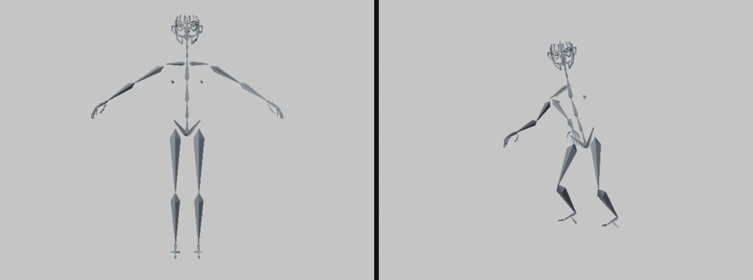
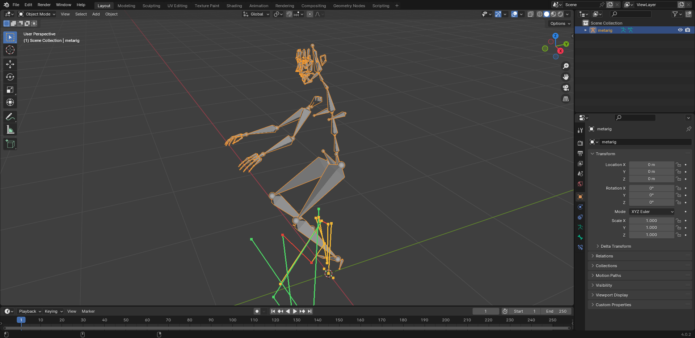

# riggermortis

**Any rig. Any image. One click — or one agent tool call. Your GPU, your characters, zero uploads.**

A local, free, rig-agnostic posing & animation engine with two frontends: a
**Blender add-on** for artists and an **MCP server** so coding agents can drive
Blender directly. Drop in an already-rigged model and a reference image — the
pose is applied. Drop in a video — the character is animated, retargeted,
foot-slide-cleaned. Photos and anime/manga art both work. Render as anime,
manga, or cartoon; lay scenes out into manga pages and comic PDFs.

Everything runs on the user's machine: no cloud, no accounts, no uploads, no
telemetry — and a CI test keeps that verifiably true.

## Status: Phase 1 engine + UX shipped — Phase 2 (video → animation) in progress

| | |
|---|---|
|  |  |

Left: the pipeline's own BOOM render — rest rig → solved pose applied through
the add-on's apply path, regenerated headlessly by
`bash xtask/render_boom.sh` (the pipeline refuses to pose anything it can't
verify to ≤0.5° per bone before shooting). Right: a genuine windowed capture
of the posed rig with the review overlay (`bash xtask/ui_screenshot.sh`;
windowed Blender GL is flaky on some boxes — the capture is self-check-gated,
never staged). Both are pipeline outputs; regenerate them yourself instead of
trusting us.

What exists **right now** (every claim cites a test, gate, or number):

- **Rig-agnostic mapping** — Rigify / Mixamo / VRM / opaque custom rigs:
  name heuristics + geometry fallback, per-role confidence, ambiguity flags.
  Real-rig gate: metarig, 706-bone generated Rigify, Seed-san VRM, and a real
  Mixamo export all map with **0 manual corrections** (`xtask/blender_verify.sh`).
- **One-image posing** — DWPose detection → 2.5D canonical solve → FK apply
  on any mapped rig, applied in-process by the add-on at **≤0.5° per bone**
  (worst measured: 0.026°, `make pose-verify`), with a viewport review
  overlay and one-click flip fixes. Honest number: on a 10-photo benchmark
  **0/10 are usable with zero review** under strict criteria (median
  confidence 0.66; legs verify, arms often need a one-click flip) — the
  review UI is the designed remedy, and the gap is decomposed in
  [docs/BENCHMARKS.md](docs/BENCHMARKS.md).
- **Video pipeline (Phase 2, underway)** — frame extraction (ffmpeg shell
  glue) → per-frame detection/solve with crash-safe resume and an honest
  failure ledger → **canonical actions** → keyframed retarget baked onto any
  mapped rig (2-frame bake verified on a real rig at 0.024°/frame) → foot
  contact detection with hysteresis → IK foot lock (slide 0.768 u → 0.000 on
  the labeled synthetic instrument; walk-in-place by design — no fabricated
  root motion) → motion denoise: hip stabilization + 1€ jitter pass
  (stabilization alone halves the breathing-induced stance slide on the
  synthetic gate). Export and the clips×rigs GIFs are next; no GIF is
  promised until the clips deserve one.
- **MCP server skeleton** — stdio JSON-RPC 2.0 with declared tool schemas;
  `inspect_rig` and `policy_status` work today, animation tools answer
  structured `not_implemented` until they're real.
- Content-policy module enforced in the core (SFW default; opt-in 18+ module
  with explicit confirmation; unconditional hard lines).

## Quickstart

```bash
pip install -e "core[dev]"
python xtask/export_fixture_rigs.py           # writes 5 example rigs
rigpose map out/fixture_rigs/mixamo.rig.json  # role mapping with confidences
rigpose policy status                          # SFW by default, documented
```

Image → pose (downloads two pinned ONNX models on the explicit `download`
command — the only network action the tool ever takes):

```bash
rigpose models download all
rigpose pose photo.jpg my_rig.rig.json --out payload.json
# then in Blender: the add-on's Apply Pose reads that payload in-process
```

With a local Blender install:

```bash
bash xtask/blender_verify.sh   # end-to-end: .blend → bridge → mapping → add-on registers
make pose-verify               # payload apply + review overlay + action bake on real rigs (needs models)
```

## Architecture

| Piece | Package | Role |
|---|---|---|
| `core/` | `riggermortis-core` | Pure-Python engine: canonical skeleton, bone-role mapping, pose solve, FK retarget, actions, contacts, cleanup, policy. No Blender dependency, no network. |
| `addon/` | Blender add-on | Artist UI (N-panel), viewport review, payload apply/bake. Thin — calls core. |
| `mcp/` | `riggermortis-mcp` | Agent tools over stdio/local socket. Thin — calls core. Structured policy refusals. |
| `xtask/` | — | Demo scene scripting, headless media rendering, benchmarks, CI glue. |
| `docs/` | — | Tutorials, benchmarks, policy, launch kit. |
| `STATE/` | — | Cross-session project state (tasks, decisions, progress). |

## Content policy (short version)

The default build is SFW. An opt-in 18+ module — off by default, enabled only
with explicit confirmation in preferences — permits adult content of fictional
adult characters, processed and rendered entirely locally. Hard lines are
enforced in the engine core and never toggle: no sexual content involving
minors, no explicit content of real identifiable people, nothing illegal. Full
text: [docs/POLICY.md](docs/POLICY.md).

## Honest limitations (current)

- One-image poses are review-ready, not zero-review: arm flips often need the
  one-click toggle (see the benchmark decomposition above). Deep forward kicks
  and hands held behind the back are known single-view ambiguities (documented
  solve limitations, not bugs).
- Anime/line-art detection is the weakest link: 3/10 of the anime benchmark
  images get no detection at all (DWPose trains on photoreal data). A fallback
  estimator is planned (P1-8a) — not implemented yet.
- The video pipeline bakes rotations, not root motion: the single-view solve
  is hip-anchored per frame, so fabricating world translation would be fake
  data. The IK foot lock makes contacts walk-in-place; hip stabilization
  removes anchor-frame noise only — a steady per-frame drift is
  low-frequency by construction and is deliberately left to the lock.
- Mapping assumes a humanoid-ish skeleton with roughly human proportions;
  quadrupeds are detected and flagged, not solved.
- `.blend` reading shells out to the user's own Blender via an edge script —
  the core library itself spawns no processes and opens no sockets.

## License

MIT — see [LICENSE](LICENSE).
